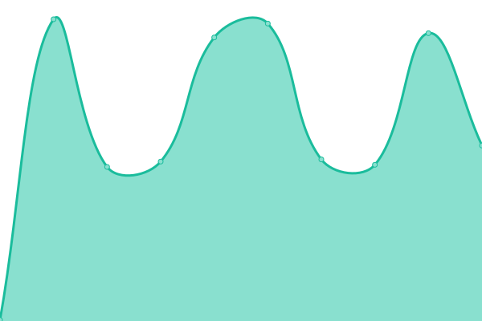
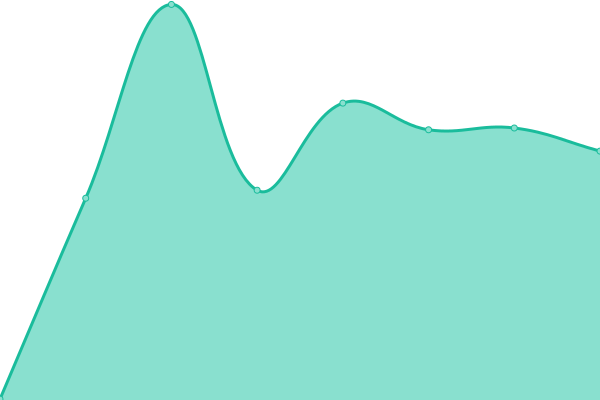
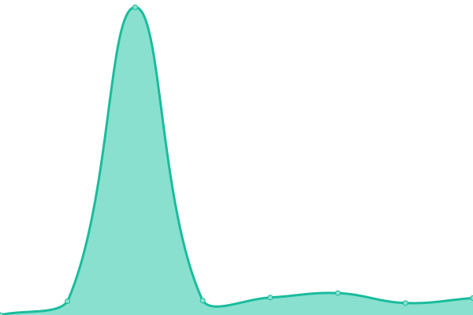

# [📈 Live Status](https://RedHatTraining.github.io/uptime): <!--live status--> **🟩 All systems operational**

This repository contains the open-source uptime monitor and status page for [Red Hat Training](https://www.redhat.com/en/services/training), powered by [Upptime](https://github.com/upptime/upptime).

With [Upptime](https://upptime.js.org), you can get your own unlimited and free uptime monitor and status page, powered entirely by a GitHub repository. We use [Issues](https://github.com/RedHatTraining/uptime/issues) as incident reports, [Actions](https://github.com/RedHatTraining/uptime/actions) as uptime monitors, and [Pages](https://RedHatTraining.github.io/uptime) for the status page.

<!--start: status pages-->
<!-- This summary is generated by Upptime (https://github.com/upptime/upptime) -->
<!-- Do not edit this manually, your changes will be overwritten -->
<!-- prettier-ignore -->
| URL | Status | History | Response Time | Uptime |
| --- | ------ | ------- | ------------- | ------ |
|  [ROL Factory](https://rol-factory.ole.redhat.com/rol/app/) | 🟩 Up | [rol-factory.yml](https://github.com/RedHatTraining/uptime/commits/HEAD/history/rol-factory.yml) | 

 297ms
     
 | 

<a href="https://RedHatTraining.github.io/uptime/history/rol-factory">100.00%</a>
    

|  [Catalog Manager](https://cm.apps.tools-na150.prod.ole.redhat.com/) | 🟩 Up | [catalog-manager.yml](https://github.com/RedHatTraining/uptime/commits/HEAD/history/catalog-manager.yml) | 

 205ms
     
 | 

<a href="https://RedHatTraining.github.io/uptime/history/catalog-manager">100.00%</a>
    

|  [Jenkins](https://jenkins.prod.nextcle.com) | 🟩 Up | [jenkins.yml](https://github.com/RedHatTraining/uptime/commits/HEAD/history/jenkins.yml) | 

 229ms
     
 | 

<a href="https://RedHatTraining.github.io/uptime/history/jenkins">100.00%</a>
    

|  [Shared Lab Report](https://labs.dle.ole.redhat.com) | 🟩 Up | [shared-lab-report.yml](https://github.com/RedHatTraining/uptime/commits/HEAD/history/shared-lab-report.yml) | 

 284ms
     
 | 

<a href="https://RedHatTraining.github.io/uptime/history/shared-lab-report">100.00%</a>
    

|  [Factory PyPi](https://pypi.apps.tools-na100.dev.ole.redhat.com) | 🟩 Up | [factory-py-pi.yml](https://github.com/RedHatTraining/uptime/commits/HEAD/history/factory-py-pi.yml) | 

 177ms
     
 | 

<a href="https://RedHatTraining.github.io/uptime/history/factory-py-pi">95.33%</a>
    

|  [NA Prod PyPi](https://pypi.apps.tools-na150.prod.ole.redhat.com) | 🟩 Up | [na-prod-py-pi.yml](https://github.com/RedHatTraining/uptime/commits/HEAD/history/na-prod-py-pi.yml) | 

 171ms
     
 | 

<a href="https://RedHatTraining.github.io/uptime/history/na-prod-py-pi">100.00%</a>
    

|  [EMEA Prod PyPi](https://pypi.apps.tools-emea160.prod.ole.redhat.com) | 🟩 Up | [emea-prod-py-pi.yml](https://github.com/RedHatTraining/uptime/commits/HEAD/history/emea-prod-py-pi.yml) | 

 435ms
     
 | 

<a href="https://RedHatTraining.github.io/uptime/history/emea-prod-py-pi">100.00%</a>
    

|  [APAC Prod PyPi](https://pypi.apps.tools-apac150.prod.ole.redhat.com) | 🟩 Up | [apac-prod-py-pi.yml](https://github.com/RedHatTraining/uptime/commits/HEAD/history/apac-prod-py-pi.yml) | 

 638ms
     
 | 

<a href="https://RedHatTraining.github.io/uptime/history/apac-prod-py-pi">100.00%</a>
    

|  [China Prod PyPi](https://pypi.apps.tools-apac152.prod.ole.redhat.com) | 🟩 Up | [china-prod-py-pi.yml](https://github.com/RedHatTraining/uptime/commits/HEAD/history/china-prod-py-pi.yml) | 

 753ms
     
 | 

<a href="https://RedHatTraining.github.io/uptime/history/china-prod-py-pi">100.00%</a>
    

<!--end: status pages-->

[**Visit our status website →**](https://RedHatTraining.github.io/uptime)

## 📄 License

- Powered by: [Upptime](https://github.com/upptime/upptime)
- Code: [MIT](./LICENSE) © [Anand Chowdhary](https://anandchowdhary.com), supported by [Pabio](https://pabio.com)
- Data in the `./history` directory: [Open Database License](https://opendatacommons.org/licenses/odbl/1-0/)
